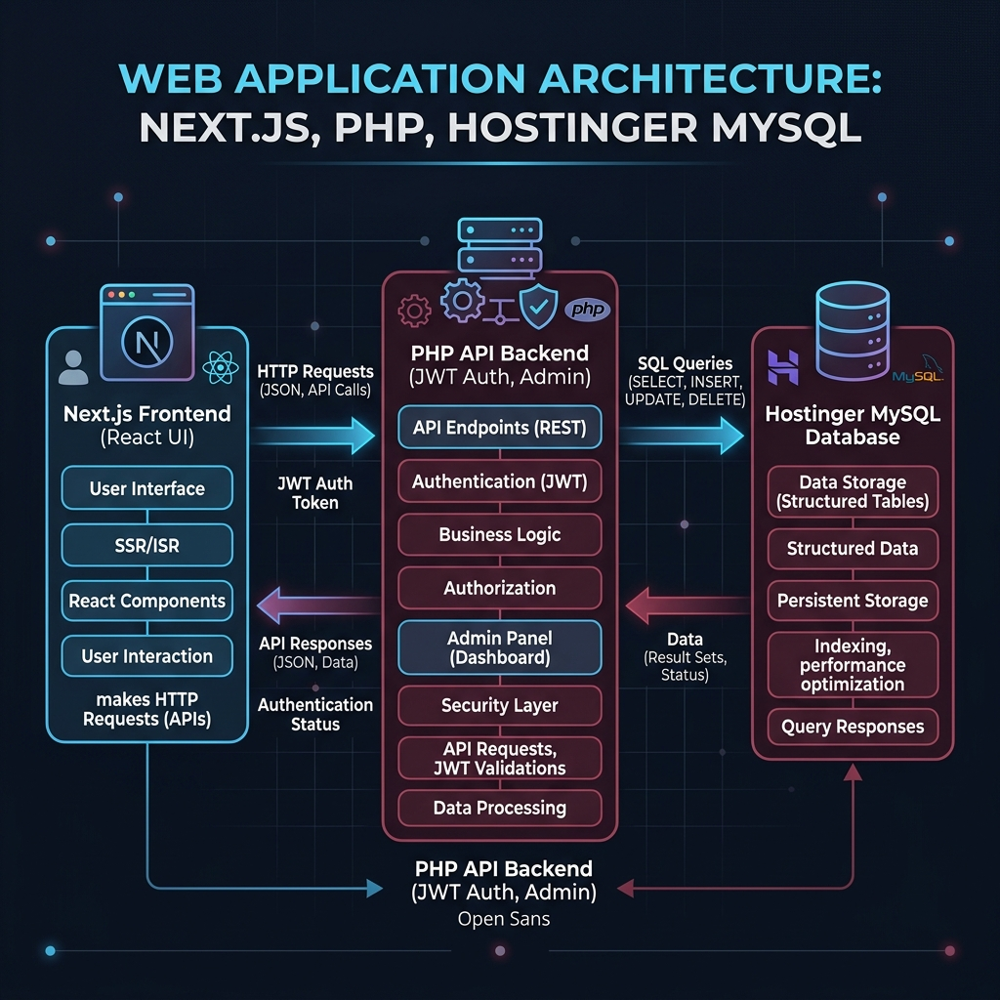

# Union Church Website

This project utilizes a modern, separated architecture with three main components:
1. **Frontend**: Next.js React Application (Static Export)
2. **Backend**: Lightweight PHP API (Authentication, Blogs, Announcements)
3. **Database**: MySQL hosted on Hostinger



---

## 🏗️ System Architecture & Workflow

- **Next.js Frontend (`/frontend`)**: A highly optimized static React application. It handles routing, UI animations (via GSAP and Framer Motion), and consumes API endpoints. It is compiled into static HTML/JS files (`/out`) for rapid deployment.
- **PHP API (`/php-api`)**: A robust, lightweight RESTful backend using PHP. It securely handles JWT-based authentication, manages admin sessions, and provides CRUD operations for blogs and church announcements.
- **MySQL Database**: A relational database running on Hostinger. It acts as the source of truth for user credentials, dynamic content, and activity logs.

---

## 🚀 How to Run the Project Locally

You will need to open **two separate terminals**.

### Terminal 1: Start the Backend & Database Server
Open a terminal, navigate to the backend, and run the dev command. This will sync your database schema, generate the client, and start Prisma Studio (a visual database management server).

```powershell
cd backend
npm run dev
```
*(Prisma Studio will open at http://localhost:5555 to view your data)*

### Terminal 2: Start the Frontend UI Server
Open a second terminal, navigate to the frontend, and run the dev command. This boots up the full Next.js UI and API routes.

```powershell
cd frontend
npm install
npm run dev
```
*(The website will open at http://localhost:3000)*

---

## 📦 Deployment Workflow (Hostinger SSH)

To deploy updates to the live server at `unionchurch.in` without uploading the massive `node_modules` folder, follow this streamlined terminal workflow from your Windows Command Prompt (`cmd`):

### 1. Build & Zip Locally
Navigate to the frontend folder, compile the production build, and create a lightweight zip file of the output:
```cmd
cd /d e:\church-website\frontend
npm run build
cd out
tar.exe -a -c -f build.zip *
```

### 2. Upload via SCP
Securely copy the generated `.zip` file directly to the server's `public_html` directory:
```cmd
scp -P 65002 build.zip u841666234@217.21.91.190:~/domains/unionchurch.in/public_html/
```

### 3. Extract on the Server via SSH
Log into Hostinger, extract the contents, and instantly apply the updates:
```cmd
ssh -p 65002 u841666234@217.21.91.190 "cd domains/unionchurch.in/public_html/ && unzip -o build.zip && rm build.zip"
```
